# My-Kids-Rx

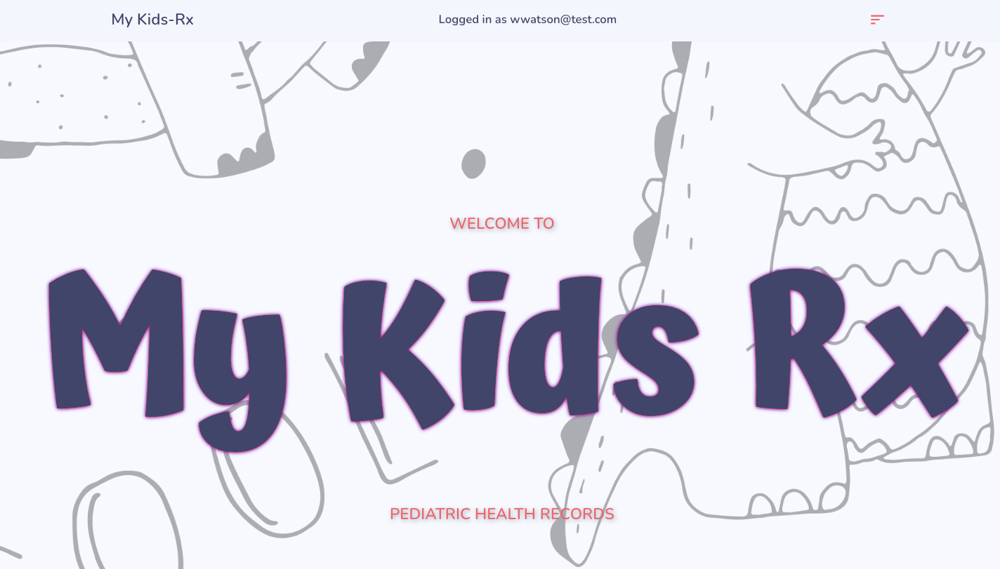

## Description
The purpose of this application is to provide an electronic system for patients to keep track of their health records. Like other electronic health record (EHR) systems, features include viewing upcoming and past appointments, medications, vaccines, and vital signs. Patients can also send and recive messages from their physician. What makes Kids-RX different is that it is specifically designed for use in pediatrics and includes features that were implemented with children in mind, including games for them to play while in a waiting room. This application currently only has a patient login, as it was built in one week, but future development will include linking it with our Kids-Rx provider application. 

## Table of Contents

- [Installation](#installation)
- [Usage](#usage)
- [Collaborators](#collaborators)
- [Credits](#credits)
- [License](#license)
- [Contributing](#contributing)
- [Questions](#questions)

## Installation

N/A

## Usage
To access this application, visit the following URL: [https://my-kids-rx-emr.herokuapp.com/](https://my-kids-rx-emr.herokuapp.com/). Browse the homepage for business information, or select one of the options in the navigation bar at the top of the page.

Select "Patient Login" to login as a patient, or the user may create a new account.

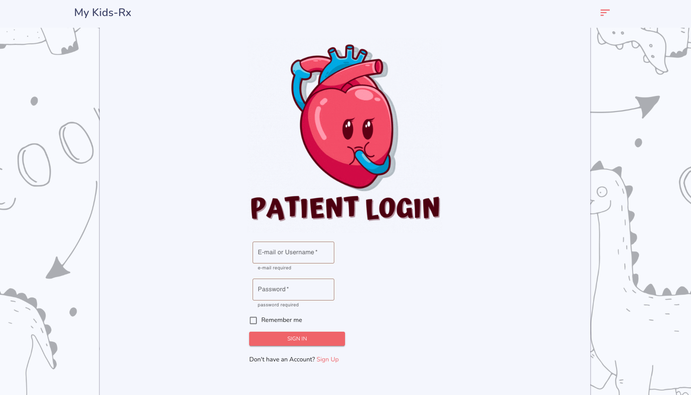

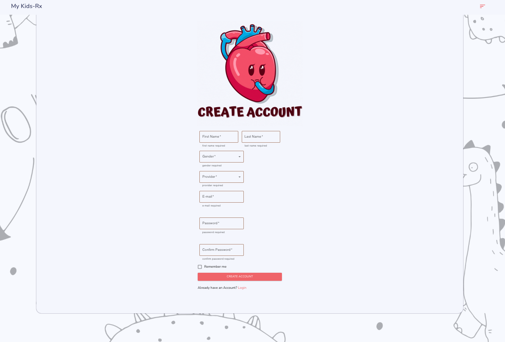

Once the user is logged in they may choose from the following options: view profile, view medical information, view appointments, view imaging results, view lab results, play games, view resources, and send/view messages.

The profile page will show account information and basic medical information, along with the options to change password and delete account. In order to carry out either of these options, the user must enter their current password correctly.

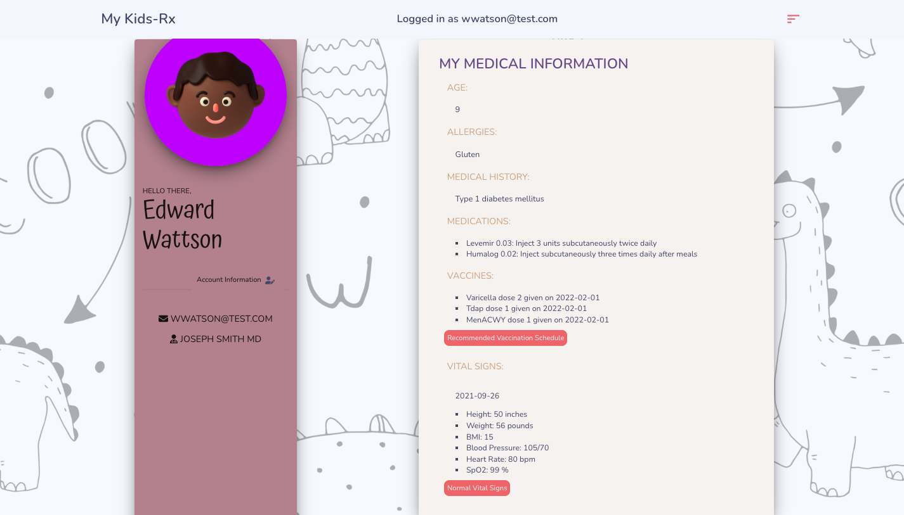

The appointments page shows upcoming appointments as well as reports from previous appointments.

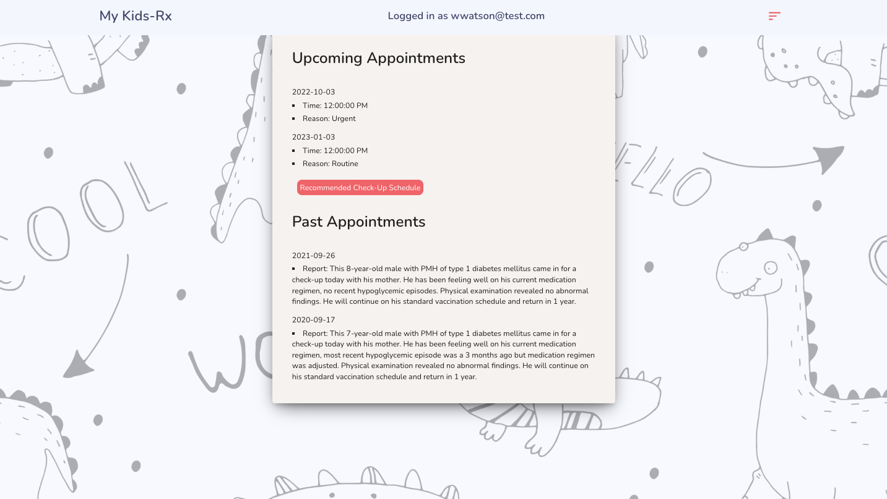

The imaging results page shows imaging results that are on file with their physician.

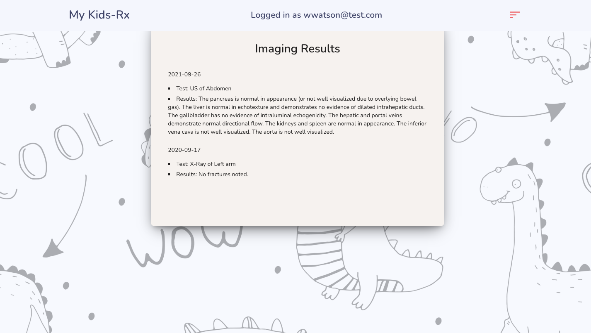

The lab results page shows lab results that are on file with their physician.

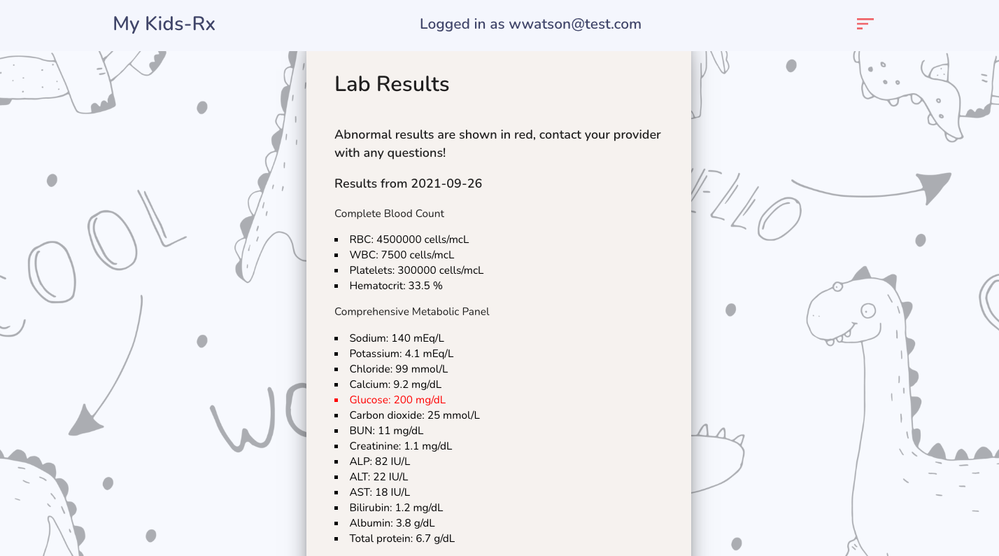

The games page has a few of options for the user to choose from: Matching, Tic-Tac-Toe, and Operation. Click on the corresponding button to be directed to a specific game.

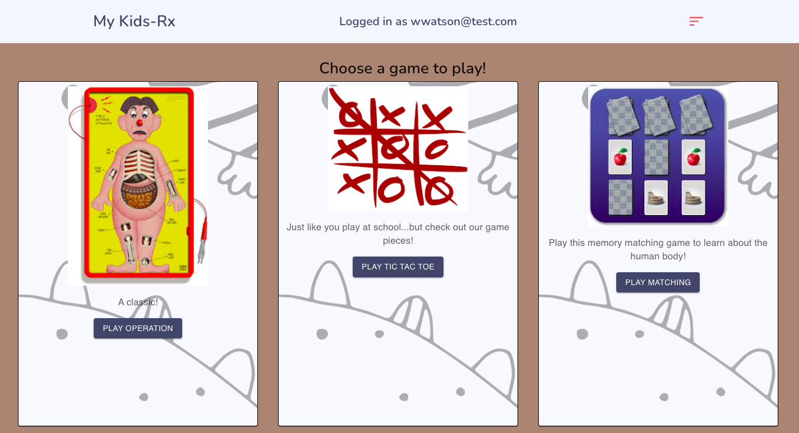

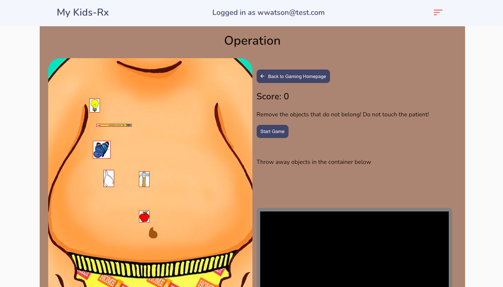

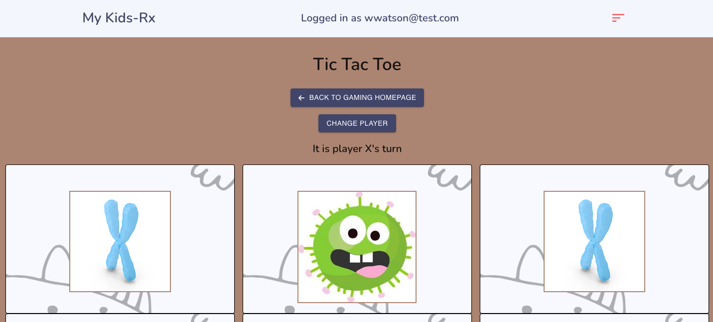

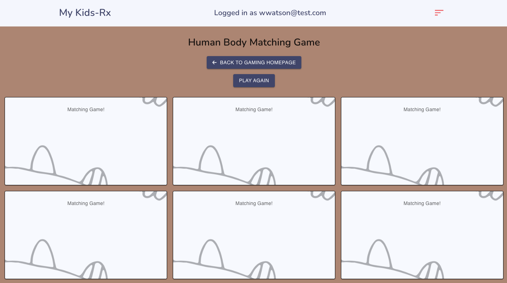

The resources page will show a randomly generated childhood illness from our database, as well as a randomly generated fun fact.

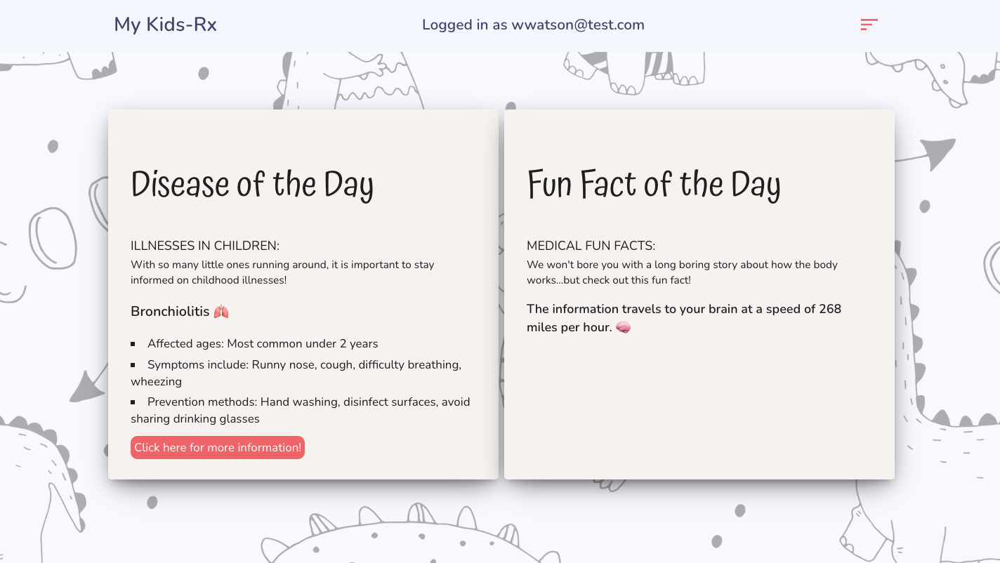

The messages page will display messages that the user previously sent to their physician. They can also send out a new message by filling out the form.

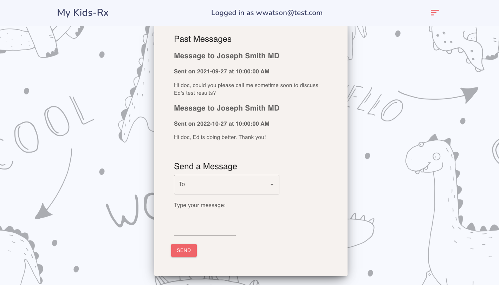

The user may log out at any time by visiting the navigation bar.

## Collaborators
- [Rita Pecuch](https://github.com/rpecuch)
- [Nick Stevens](https://github.com/stezzzy)
- [Kevin Crespo](https://github.com/kcrespo15)

## Credits
This project was built using the following Node.js packages: apollo-server-express, dotenv, express, graphql, jsonwebtoken, mongoose, apollo/client, emotion/react emotion/styled, fontsource/roboto, font awesome, material-ui, mui, jwt-decode, moment, react, react-dom react-external-link, react-scripts, and react-scroll.

The [Mayo Clinic](https://www.mayoclinic.org/diseases-conditions) website was used to build our database of childhood illness information.

The [National Geographic Kids](https://www.natgeokids.com/uk/discover/science/general-science/15-facts-about-the-human-body/) website was used while building our database of human body fun facts.

## License

This application is covered under the MIT license.
To view a description of this license type, refer to the repository or click [♡ here ♡](https://opensource.org/licenses/MIT).

## Contributing

Ways to contribute include suggesting bug fixes and ideas for new features. 

## Questions
If you have any questions or would like to provide feedback, do not hesitate to contact any of the collaborators.
  - Clarence Go: cmarie.go97@gmail.com
  - Rita Pecuch: rpecuch@comcast.net
  - Nick Stevens: nickyapril123@gmail.com
  - Kevin Crespo: KevinCrespo15@gmail.com
